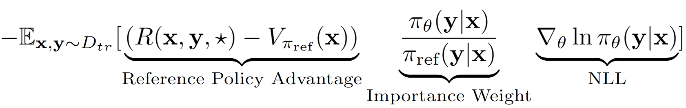

# Advantage Leftover Lunch Reinforcement Learning (A-LoL RL)

We introduce a new offline RL algorithm for language model fine-tuning that can incorporate any real-value🌍 reward function on any pre-existing language data📖.  
The 🗝️key assumption is to treat the entire output sequence from LM as a single action in RL setup. Using this assumption we obtain a sequence level value estimate of the reference policy with its validation set performance. The reference policy in our case is simply the SFT model finetuned with negative log likelihood (NLL) i.e. Behavior Cloning. The final learning equation for A-LoL looks like:  
  
👉 Using the reference policy value estimate, we find the subset of training set that still has positive advantage (i.e. Leftover Lunch 🍱) and only train on that subset with prioritized sampling. We additionally test three variants of A-LoL by modifying the importance weight term - **A-LoL ref-free, A-LoL seq, A-LoL KL** (more details in the [paper](https://arxiv.org/abs/2305.14718)).

## Experiments

Due to the flexibility of A-LoL to incorporate arbitrary reward functions and data sources🤯, we train language models on a variety of language models tasks including: (1) Helpful and Harmless Assistant (HHA), (2) Commonsense Transformer (COMET) generation task, (3) Reddit Response generation with 5 different rewards, (4) Faithful Knowledge Grounded Dialogue Generation with 4 rewards. In each experiment we compare A-LoL with other offline policy gradient methods such as weighted behavior cloning (wBC) and Reward GOLD (a modified version of a previous method GOLD). In HHA, we also compare with popular preference-based offline RL methods including PRO, DPO and standard online PPO implementation. Overall, A-LoL methods are very stable and outperform other methods in most of the experiments across all rewards. 

Install Packages: `pip install -r requirements.txt`

### 1. Harmless and Helpful Assistant Task - 7B LLaMA QLoRA experiment  
The goal is to finetune LLaMA 7B model on HHA dataset to improve helpfulness and safety when responding to difficult user queries. We reuse the data and reward models from PRO.

**How to get Harmless and Helpful Assistant Task Dataset?**  
1. Get the data from PRO repo: https://github.com/AlibabaResearch/DAMO-ConvAI/tree/main/PRO  
    `wget https://ylab-mobile-prod.oss-cn-beijing.aliyuncs.com/yueli.ybw/data.zip`  
2. Unzip the data.zip file and save it in `data/` folder. The folders `hh_dev`, `hh_test`, `hh_train_len2` should be present in `data/` folder.  
3. Remove the bad training data with abruptly ending responses  
    `python data_cleaning.py`  

**How to train models with Reward and Advantage based offline RL methods?**  
`python lolrl_qlora_llama_hh.py`  
Parameters and options:
1. `--algorithm`: options - `['nll', 'wbc', 'r_gold', 'r_lol', 'a_lol', 'a_lol_ref_free', 'a_lol_seq', 'a_lol_kl']`
2. `--sampling_strategy`: default `None`. Option `good_priority` to be used with Advantage or Reward based Offline RL 
3. `--ppo_clip`: default `0.9`. PPO clip parameter for R-LoL, A-LoL and A-LoL seq
4. `--kl_beta`: default `0.2`. KL beta parameter for A-LoL KL

**How to train models with Preference-based Offline RL methods?**  
1. DPO: `python dpo_qlora_llama_hh.py --output_dir "./checkpoints/dpo_qlora_llama/"`. Add `--reference_free` to test the reference-free version of DPO.  
2. PRO: `python pro_qlora_llama_hh.py --output_dir "./checkpoints/pro_qlora_llama/"`

**How to train models with Online RL methods?**
1. PPO: `python ppo_qlora_llama_hh.py --output_dir "checkpoints/ppo_timdettmers_qlora_llama_3e/" --cache_dir "cache/ppo_tim_cache" --total_steps 3000`  
2. Evaluate existing PPO checkpoint: `python ppo_hh_eval.py --model_name_or_path "reciprocate/ppo_hh_pythia-6B" --output_dir "checkpoints/ppo_hh_pythia_6B/"`

**How to evaluate any QLoRA model on test set?**  
`python qlora_llama_hh_eval.py --adapter_path [PATH_TO_ADAPTER] --output_dir [OUTPUT_DIR]`

Uploaded pretrained adapters for Helpful and Harmless Assistant Task from the best methods to huggingface
1. A-LoL seq. - [abaheti95/a_lol_seq_good_prioirty_qlora_hh](https://huggingface.co/abaheti95/a_lol_seq_good_prioirty_qlora_hh)
2. A-LoL - [abaheti95/a_lol_good_prioirty_qlora_hh](https://huggingface.co/abaheti95/a_lol_good_prioirty_qlora_hh)
3. A-LoL KL - [abaheti95/a_lol_kl_good_prioirty_qlora_hh](https://huggingface.co/abaheti95/a_lol_kl_good_prioirty_qlora_hh)
4. DPO - [abaheti95/dpo_qlora_hh](https://huggingface.co/abaheti95/dpo_qlora_hh)

### 2. Commonsense Transformer - COMET 1.5B GPT2-XL experiment
The goal is to improve commonsense reasoning of COMET model on ATOMIC^10x data by using COMET-critic classifier as the reward function.
##### Preprocessing

1. Acquire the ATOMIC^10x dataset:
    [Download](https://storage.googleapis.com/ai2-mosaic-public/projects/symbolic-knowledge-decoding/symbolic-knowledge-distillation.tar.gz) SKD data and save in `data/symbolic_knowledge_distillation/`  
2. Convert pretrained COMET critic from original paper to huggingface format  
    `python convert_keras_roberta_to_huggingface.py`
    > Saved the final classifer as RobertaModel, Tokenizer and Custom Classification Head with specific activations at `saved_models/comet_critic_keras_to_pytorch`.   
    > Classifier is saved in "custom_roberta_classification_head.pt" file within the folder  
    > Initialize the Classification head as follows: RobertaClassificationHead(1024, 512, 1)  
3. ATOMIC-COMET preprocessing and reward extraction  
    `python preprocess_comet_and_add_rewards.py -i data/symbolic_knowledge_distillation/downloaded -it data/symbolic_knowledge_distillation/atomic2020/atomic2020_data-feb2021/ -ccm saved_models/comet_critic_keras_to_pytorch -o data/comet_rewarded/ -bs 32`

##### Reward and Advantage-based Offline RL command

`python train_generation_task_with_off_policy_PG.py -i data/comet_rewarded/ -tn COMET -m data/symbolic_knowledge_distillation/downloaded/comet-distill/ -s [MODEL_SAVE_DIR] -o [OUTPUT_DIR] -mt data/symbolic_knowledge_distillation/downloaded/comet-distill-tokenizer/ -ccm saved_models/comet_critic_keras_to_pytorch -ml 30 -algo [ALGORITHM] -vf 16 -e 1 -bs 16 -as 1 -v_bs 32 -t -ev_b`  
ALGORITHM options: `["nll", "wbc", "r_gold", "r_lol",  "a_lol", "a_lol_ref_free", "a_lol_seq", "a_lol_kl"]`

##### Aggregate COMET results
`python aggregate_generation_task_results.py -bmps "{'comet_distill': True}" -tn COMET -o final_results/comet_final_results.csv`


### 3. Reddit positive and negative comment generation task
The goal is to train a Reddit dialog model that simultaneously improves 5 aspects: Fluency, Safety, Engagement, Upvote Probability and Diversity. We employ pre-existing sequence classifiers for each attribute and sum all scores into a final scalar reward. To test the robustness of A-LoL towards noisy data, we create two training data splits: (1) only upvoted comments and (2) only downvoted comments.

##### Preprocessing  

1. Data Download:
    Download the upvoted and downvoted reddit comment pairs from: https://www.kaggle.com/code/danofer/reddit-comments-scores-nlp/input

    > Positive comments score 10 percentile: [66.0, 72.0, 79.0, 88.0, 100.0, 116.0, 139.0, 174.0, 236.0, 385.0, 9582.0]  
    > Negative comments score 10 percentile: [-2946.0, -25.0, -18.0, -14.0, -12.0, -10.0, -9.0, -8.0, -8.0, -7.0, -6.0]  
2. Reward prediction:
    [Download the toxichat classifiers](https://mega.nz/file/ANhEWDiA#ky-f6HNfmgM4-QVpNv_-z5cN1yf4d0Ml6PAEWHnQVCg) and save them in `saved_models`  

    `python preprocess_reddit_comment_scores_and_add_rewards.py -i data/reddit_comment_scores_kaggle/ -m microsoft/DialoGPT-medium -cm textattack/roberta-base-CoLA -ucm microsoft/DialogRPT-updown -dcm microsoft/DialogRPT-depth -om saved_models/DGPT_medium_OC_S_and_SBF_offensive_e2 -o data/reddit_comment_scores_kaggle/preprocessed `
3. Train DialoGPT-medium NLL Reference Policy on Reddit Upvoted (`reddit_pos`) and Downvoted (`reddit_neg`) comments  
    `python train_generation_task_with_off_policy_PG.py -i data/reddit_comment_scores_kaggle/preprocessed -tn reddit_pos -m microsoft/DialoGPT-medium -s saved_models/reddit_pos/dgpt_nll -o final_results/reddit_pos/dgpt_nll/train_log -cm textattack/roberta-base-CoLA -ucm microsoft/DialogRPT-updown -dcm microsoft/DialogRPT-depth -om saved_models/DGPT_medium_OC_S_and_SBF_offensive_e2 -algo nll -vf 2 -e 6 -t -bs 8 -as 2 -v_bs 32`  
    `python train_generation_task_with_off_policy_PG.py -i data/reddit_comment_scores_kaggle/preprocessed -tn reddit_neg -m microsoft/DialoGPT-medium -s saved_models/reddit_neg/dgpt_nll -o final_results/reddit_neg/dgpt_nll/train_log -cm textattack/roberta-base-CoLA -ucm microsoft/DialogRPT-updown -dcm microsoft/DialogRPT-depth -om saved_models/DGPT_medium_OC_S_and_SBF_offensive_e2 -algo nll -vf 2 -e 6 -t -bs 8 -as 2 -v_bs 32`  

##### Reward and Advantage-based Offline RL command

`python train_generation_task_with_off_policy_PG.py -i data/reddit_comment_scores_kaggle/preprocessed -tn [TASK_NAME] -m saved_models/[TASK_NAME]/dgpt_nll -s [MODEL_SAVE_DIR] -o [OUTPUT_DIR] -cm textattack/roberta-base-CoLA -ucm microsoft/DialogRPT-updown -dcm microsoft/DialogRPT-depth -om saved_models/DGPT_medium_OC_S_and_SBF_offensive_e2 -algo [ALGORITHM] -vf 2 -e 3 -bs 8 -as 2 -v_bs 32 -t -ev_b`  
TASK_NAME options: `["reddit_pos", "reddit_neg"]`  
ALGORITHM options: `["nll", "wbc", "r_gold", "r_lol",  "a_lol", "a_lol_ref_free", "a_lol_seq", "a_lol_kl"]`  

##### Aggregate Reddit POS and NEG results
```bash
python aggregate_generation_task_results.py -bmps "{'dgpt_nll': True}" -tn reddit_pos -o final_results/reddit_pos_final_results.csv
python aggregate_generation_task_results.py -bmps "{'dgpt_nll': True}" -tn reddit_neg -o final_results/reddit_neg_final_results.csv
```

### 4. Faithful Knowledge Grounded Dialogue Generation Task
The goal is to train a Faithful Knowledge Grounded dialog model that simultaneously improves 4 aspects: Faithfulness, Fluency, Engagement and Diversity. We employ pre-existing sequence classifiers for each attribute and sum all scores into a final scalar reward. We again use three different data splits: (1) Wizards of Wikipedia (WoW) - noisy/low quality, (2) FaithDial - cleaner and (3) WoW + FaithDial.

##### Preprocessing
1. Download WoW dataset: http://parl.ai/downloads/wizard_of_wikipedia/wizard_of_wikipedia.tgz
2. Preprocess for specific task:
    `python preprocess_wow_and_add_rewards.py -i [TASK_NAME] -o data/[TASK_NAME]/preprocessed_and_rewarded/ -m microsoft/DialoGPT-medium -cm textattack/roberta-base-CoLA -fcm McGill-NLP/roberta-large-faithcritic -dcm microsoft/DialogRPT-depth -bs 32`  
    TASK_NAME options: `["wow", "faithdial", "faithdial_wow"]`  
3. Train DialoGPT-medium NLL Reference Policy  
    `python train_generation_task_with_off_policy_PG.py -i data/[TASK_NAME]/preprocessed_and_rewarded/ -tn [TASK_NAME] -m microsoft/DialoGPT-medium -s saved_models/[TASK_NAME]/dgpt_nll -o final_results/[TASK_NAME]/dgpt_nll/train_log -cm textattack/roberta-base-CoLA -fcm McGill-NLP/roberta-large-faithcritic -dcm microsoft/DialogRPT-depth -algo nll -vf 2 -e 6 -t -bs 8 -as 2 -v_bs 32`  
    TASK_NAME options: `["wow", "faithdial", "faithdial_wow"]`

##### Reward and Advantage-based Offline RL command
`python train_generation_task_with_off_policy_PG.py -i data/[TASK_NAME]/preprocessed_and_rewarded/ -tn [TASK_NAME] -m saved_models/[TASK_NAME]/dgpt_nll -s [MODEL_SAVE_DIR] -o [OUTPUT_DIR] -cm textattack/roberta-base-CoLA -fcm McGill-NLP/roberta-large-faithcritic -dcm microsoft/DialogRPT-depth -algo [ALGORITHM] -vf 2 -e 3 -bs 8 -as 2 -v_bs 32 -t -ev_b`  
TASK_NAME options: `["wow", "faithdial", "faithdial_wow"]`  
ALGORITHM options: `["nll", "wbc", "r_gold", "r_lol",  "a_lol", "a_lol_ref_free", "a_lol_seq", "a_lol_kl"]`  

##### Aggregate results

`python aggregate_generation_task_results.py -bmps "{'dgpt_nll': True}" -tn [TASK_NAME] -o final_results/[TASK_NAME]_final_results.csv`  
TASK_NAME options: `["wow", "faithdial", "faithdial_wow"]`  

paper: https://arxiv.org/abs/2305.14718
```
@misc{baheti2023improving,
      title={Improving Language Models with Advantage-based Offline Policy Gradients}, 
      author={Ashutosh Baheti and Ximing Lu and Faeze Brahman and Ronan Le Bras and Maarten Sap and Mark Riedl},
      year={2023},
      eprint={2305.14718},
      archivePrefix={arXiv},
      primaryClass={cs.CL}
}
```